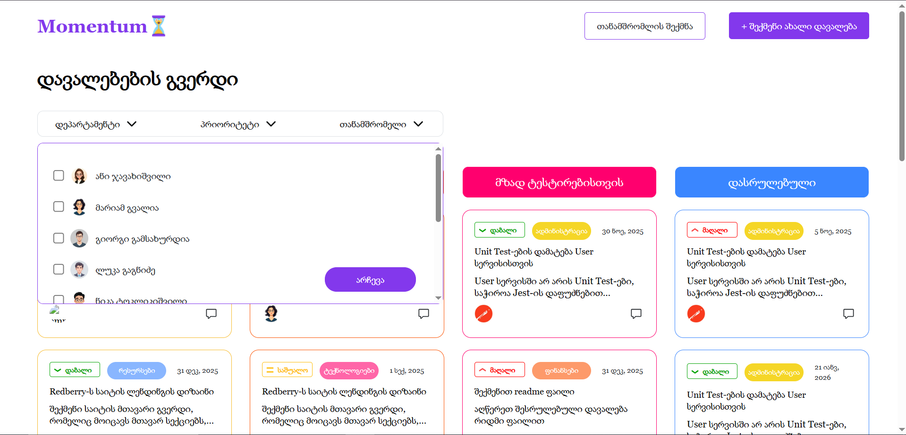

# Progress Tracker App

A React-based progress tracking application that allows teams to manage tasks and employees. 
Features include a task grid, adding new tasks, assigning employees, and monitoring task progress.

## Features
- View tasks in a dynamic task grid
- Filter tasks by departments, priorities and employees
- Add new tasks
- Add new employees
- Assign tasks to employees
- Track task and employee progress

## Tech Stack
- React
- Zustand (state management)
- Vite (build tool)
- TailwindCSS (styling)

## Installation

Make sure you have Git, Node.js and npm installed on your device,
only then type the following commands in terminal

- git clone https://github.com/mari-ashordiaMomentum-Progress-Tracking-Software.git
- cd progress-tracker
- npm install
- npm run dev

then type http://localhost:5173 in  your browser

## Screenshots

Tasks grid view

Filter dropdown

Create a new task

Task details page

Create a new employee

## License
This project is licensed under the MIT License.